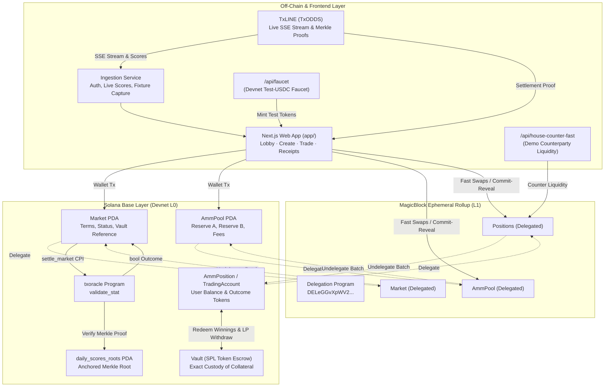
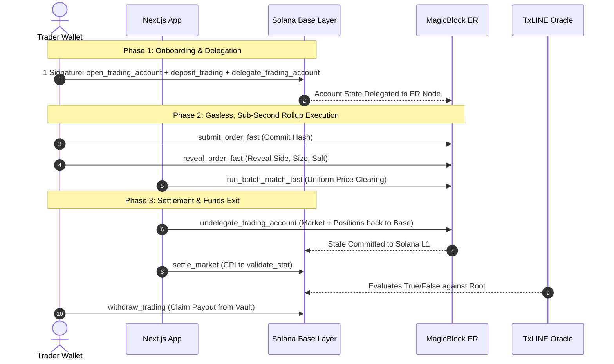
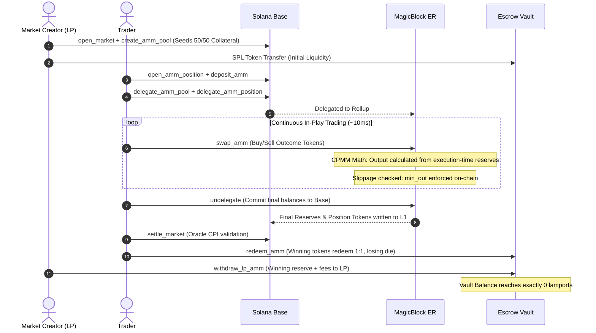

# LIVE DEMO & TECHNICAL SUBMISSION DOCUMENT

# ONYX (AETHER)
### Polymarket-Style Continuous Trading on a MagicBlock Ephemeral Rollup with Trustless Oracle Settlement on Solana

---

## Executive Summary & Quick Links

| Key Reference | Value / Link | Description |
|---|---|---|
| **Live Web App** | [`onyx.ansht.tech`](https://onyx.ansht.tech) | Production deployment on devnet |
| **Solana Program ID** | [`4LpMzq6wXYFMzxgbyMyN2ja4EQhPsYGHSCAvjwzA18MB`](https://explorer.solana.com/address/4LpMzq6wXYFMzxgbyMyN2ja4EQhPsYGHSCAvjwzA18MB?cluster=devnet) | Native Pinocchio (`no_std`, zero-Anchor overhead) |
| **TxLINE Oracle Program** | [`6pW64gN1s2uqjHkn1unFeEjAwJkPGHoppGvS715wyP2J`](https://explorer.solana.com/address/6pW64gN1s2uqjHkn1unFeEjAwJkPGHoppGvS715wyP2J?cluster=devnet) | Live Merkle stat-validation oracle (TxODDS) |
| **MagicBlock ER Router** | `https://devnet-router.magicblock.app` | Sub-second Ephemeral Rollup cluster |
| **MagicBlock ER Node** | `https://devnet-as.magicblock.app` | Delegated execution endpoint |
| **One-Command Sealed Demo** | `bun run demo` | Commit → Reveal → Uniform Batch Match → Settle CPI → Claim |
| **One-Command AMM Demo** | `bun run demo:amm` | Base layer CPMM: Seed LP → Swap Buy/Sell → Settle → Drain |
| **One-Command ER Concurrency** | `bun run demo:amm-er` | Concurrent multi-wallet swaps on ER + Replay audit |
| **One-Command Session Trading** | `bun run demo:session` | 1-signature session key → Gasless/Popup-free trading on ER |

---

## 1. The Six-Part Architecture Story

### 1. Trustless Settlement (Zero Off-Chain Resolvers)
Every market settles via a direct Cross-Program Invocation (CPI) from the `settle_market` instruction into TxLINE's on-chain `validate_stat` program (`6pW64gN1s2uqjHkn1unFeEjAwJkPGHoppGvS715wyP2J`). The program reads back a strict boolean return value evaluated against anchored Merkle root state (`daily_scores_roots`). 
- **No admin keys**, no multi-sig council, no off-chain resolver bot with payout discretion.
- **Deterministic**: Given the same Merkle proof and predicate, the on-chain payout is bit-exact and immutable.

### 2. Independently Verifiable On-Chain Receipts
Settled markets produce an indelible audit trail on the Solana base layer. Anyone with access to a public RPC node can independently verify:
1. `validate_stat`'s on-chain log line: `Evaluate predicate to: true / false`.
2. The boolean return buffer returned across the CPI boundary.
3. The `Market` account PDA's `status` (Settled) and `outcome` (1 or 2).
4. Direct inspection route available at `/receipt/:market` in the web application.

### 3. Parametric Props (Multi-Stat Predicates)
Markets are not limited to binary "Who wins?" outcomes. Prediction markets are predicates over real-time match stats:
$$\text{Predicate} = \text{Stat}_A \; [\text{op} \; \text{Stat}_B] \gtrless \text{Threshold}$$
Supported metrics include Corners, Yellow/Red Cards, Expected Goals (xG), Offsides, Shots on Target, and combined two-stat expressions (e.g. `Home Corners + Away Corners > 9`).

### 4. Sell-Anytime AMM Continuous Trading (Polymarket-Style)
The liquidity pool acts as the immediate automated counterparty using a Constant Product Market Maker (CPMM) curve over virtual complete-set outcome tokens ($Tokens_A + Tokens_B$):
$$R_A \cdot R_B = k$$
- **Real Seeded Capital**: The market creator seeds initial liquidity (50/50 ratio) and acts as the LP, bearing authentic adverse-selection risk.
- **Instant Two-Way Liquidity**: Traders can buy **and sell** outcome tokens at any point prior to market close without waiting for an order matching window.
- **Program-Enforced Slippage Protection**: Swaps specify `amount_in` and `min_out`. The output is calculated on-chain from execution-time reserves; transactions revert with `Custom(6026)` (`SlippageExceeded`) if execution price degrades.
- **Solvency Identity**: The invariant holds to the exact lamport:
$$\text{Vault Balance} = \sum \text{Deposits} + \text{Sets Outstanding} + \text{Fees Accrued}$$
Upon settlement, winning tokens redeem 1:1, losing tokens expire worthless, and the vault drains to **exactly 0 lamports**.

### 5. Sub-Second Execution on MagicBlock Ephemeral Rollups
Both AMM swaps and Sealed Batch matching run on MagicBlock Ephemeral Rollups (ER) with sub-second execution (~10–50ms block times, validator-sponsored gas fees):
- **Account Delegation**: The `Market`, `AmmPool`, and user `TradingAccount` / `AmmPosition` PDAs are delegated to the ER delegation program (`DELeGGvXpWV2fqJUhqcF5ZSYMS4JTLjteaAMARRSaeSh`).
- **Concurrent Swap Replay Audit**: In high-contention testing (4 wallets submitting concurrent swaps in the exact same ER slot), swaps serialize deterministically. Replaying all permutations through the CPMM math proves that **exactly 1 ordering** matches final on-chain reserves with zero lost updates.
- **Unified Undelegation**: Once trading concludes, all accounts undelegate back to Solana base layer in a single transaction, ready for base-layer oracle settlement.

### 6. MEV Honesty by Construction
- **Sealed-Batch Markets (MEV-Proof)**: 32-byte cryptographic commitments ($Hash(Side, Size, Nonce)$) hide order details during the commit phase. Batches clear at a single uniform clearing price with no time-priority advantage.
- **AMM Markets (MEV-Disclosed)**: Continuous AMMs are subject to sequencer ordering. The application explicitly discloses this in the trading panel and enforces `min_out` slippage bounds on-chain rather than making unprovable claims.

---

## 2. System Architecture & Flowcharts

### Global Architecture Topology



---

### Ephemeral Rollup (ER-Fast) Lifecycle



---

### Continuous AMM Trading Lifecycle



---

## 3. Verifiable Proof Matrix (Real Devnet Transactions)

Every transaction below occurred on the Solana Devnet and is independently verifiable on the [Solana Explorer](https://explorer.solana.com/?cluster=devnet) or via `solana confirm -v <signature> --url https://api.devnet.solana.com`.

### A. Sealed-Batch MEV-Proof Market Lifecycle
*Market PDA:* [`2VGU78vkkcYbHkdsZiowVi9R4KatY8BB1zVD32kHdHG4`](https://explorer.solana.com/address/2VGU78vkkcYbHkdsZiowVi9R4KatY8BB1zVD32kHdHG4?cluster=devnet)

| Stage | Ledger | Transaction Signature | On-Chain Verification Details |
|---|---|---|---|
| **Sealed Commit** | Base | [`52VkeMw5eiV3...`](https://explorer.solana.com/tx/52VkeMw5eiV3xnnAPWkmSkUsLEAUa5Av7aKi94nRi7PxRWfQFQnk8n2UVcGo367phbD3Caz7Q5fnPqL9SKvsP2vn?cluster=devnet) | Inspect `SealedOrder` PDA: Side (byte 121) and Size (bytes 128–135) are blank zeros. Only the 32-byte commitment hash and collateral are on-chain. |
| **Batch Match** | Base | [`JMUsrZCwhQh9Tsw...`](https://explorer.solana.com/tx/JMUsrZCwhQh9TswLTqV5e8knabZmgB6G2pKa23DYVQBZdtrBgZDgMVAzKVSWRLn6S31FGJUNdE6P6CyrwXrHHGJ?cluster=devnet) | `Market.phase` flips to `Matched (3)`. Uniform clearing price is set. Deterministic matching proven order-independent. |
| **Oracle Settle** | Base | [`5tLRuV7XPCsRsGddA9...`](https://explorer.solana.com/tx/5tLRuV7XPCsRsGddA962y6Mpws1pRSeBqMH9hBBs7notEZCxUSkeWFEo1Cd9i1nb84sVms5p8ZQ7dgBdTsxXi6rF?cluster=devnet) | Program logs show CPI into `6pW64gN1...`, log line `Evaluate predicate to: true`, and boolean return value. |
| **Claim Payout** | Base | [`2XZr6xuPH4L15SXZ...`](https://explorer.solana.com/tx/2XZr6xuPH4L15SXZcHbL27qJ2BgMNfA7eGkTrf7MeMv76imq3jSULTaeyAxg5PhU7Svdsaky4Rbj8mwxT4xtTxDm?cluster=devnet) | Payout formula: $\text{Stake} + \frac{\text{Stake}}{\text{Win Pool}} \times \text{Lose Pool} - 1\% \text{ Fee}$. $1,000,000 \to 1,990,000$ units. |

---

### B. Ephemeral Rollup (ER-Fast) Sub-Second Lifecycle
*Market PDA:* [`HUBmAk24oRg8rCT55XA5RSyXtW4Xz573qysbDtU83kuR`](https://explorer.solana.com/address/HUBmAk24oRg8rCT55XA5RSyXtW4Xz573qysbDtU83kuR?cluster=devnet)

| Stage | Ledger | Transaction Signature | On-Chain Verification Details |
|---|---|---|---|
| **Delegate Market** | Base | [`25Y5K99u...`](https://explorer.solana.com/tx/25Y5K99uizdvsWmpKYQ26tz6nN4Kng4r3CDcSMRn6eurStkiVsHd8JQDpU65dzbz6Br96QXwP4rFxtoMvaRFRy4S?cluster=devnet) | `Market` account owner flips to Delegation Program (`DELeGGvXpWV2fqJUhqcF5ZSYMS4JTLjteaAMARRSaeSh`). |
| **Deposit + Enable** | Base | [`4M5cBpBG...`](https://explorer.solana.com/tx/4M5cBpBGBxfj7m24UWqEG8tPCm8K6HW1WE5NHCikXQ6Y5usXd7YuNsLXzkF2TyVkMNGDirz72jpZnnUMomkKqyH9?cluster=devnet) | 1 atomic transaction with 3 instructions: `open_trading_account` + `deposit_trading` + `delegate_trading_account`. |
| **Fast Commit** | **ER** | [`2R3Liugb...`](https://explorer.solana.com/tx/2R3LiugbLjPTwij7NDKGZEJ1vJkfeLmRUNjvnYBu5Uhh5aUS9GVvBiVKnYAfxvy8dBQwhXrTbqcXJq1xkvLp1LbR?cluster=devnet) | Confirmed Finalized on ER endpoint (`devnet-as.magicblock.app`); returned **not found** on base layer, proving true off-chain delegation. |
| **Fast Reveal** | **ER** | [`TLwJ2RGF...`](https://explorer.solana.com/tx/TLwJ2RGFC3jsrpFDa9wS2UNUAQqrqABoQ127eJ5zsdM86dQso3cbJu4oUMgpBc9LHnx1K1jxRiWhNEK6s3RdU9J?cluster=devnet) | `TradingAccount.status` transitions to `Revealed` on the rollup in <50ms. |
| **Fast Batch Match** | **ER** | [`2qQnKRn2...`](https://explorer.solana.com/tx/2qQnKRn24QLQLjAxtEDAZGPNTie6Wk8uHqzBTbWcyp4JNrojrg1BniRsjpo9GoPQMnTnfbsR146X4ZH2SzNbdnvP?cluster=devnet) | `Market.phase` flips to `Matched` on ER; uniform clearing price calculated and executed. |
| **Undelegate All** | ER $\to$ Base | [`hbYdEt1X...`](https://explorer.solana.com/tx/hbYdEt1XoFSMwxwnjskNgD8YfCp4G9DCSYjqiSbvbT8LbW3Uvj86uyfhEbpoTV6aYSSMz5vAKHbSqw5wGH72cfy?cluster=devnet) | Multi-account undelegation: Market and all user TradingAccounts committed back to Solana L1 in **one single instruction**. |
| **Oracle Settle** | Base | [`4frNeytM...`](https://explorer.solana.com/tx/4frNeytM3JtCzA1brd6McWDvFiWK1XBMp3K38szm7hjYkisQ7pHc6VELr4aMQqf9nDcWLigyxEezCtQYjwRy8MK8?cluster=devnet) | Same `settle_market` instruction executes on base layer via TxLINE CPI. |
| **Withdraw** | Base | [`2JeypKSy...`](https://explorer.solana.com/tx/2JeypKSy5eifDb88emVT3X9qoEek8DHjqfQkxzniDtVncyUumahNnAtqdZ1kJiusVjhNcPHhXLQXZ4QifQzw9wVW?cluster=devnet) | `TradingAccount.claimed_winnings = true`, funds safely transferred to user ATA. |

---

### C. Continuous AMM Trading Lifecycle (3-Tier Proof)
*Market PDA:* [`8PAJAkwZKxao5NCLbZpuaGZpJVi5b2gKc8Gf71EXZheg`](https://explorer.solana.com/address/8PAJAkwZKxao5NCLbZpuaGZpJVi5b2gKc8Gf71EXZheg?cluster=devnet)

| Stage | Ledger | Transaction Signature | On-Chain Verification Details |
|---|---|---|---|
| **Create & Seed Pool** | Base | [`3d1sW7oB...`](https://explorer.solana.com/tx/3d1sW7oBZFwWkpRV7tJN31yQ3LU8aD354uNxr8bLDEec56WuoUPKb8xHk2JP3KzZMdGb92w9F71J2LbE8B2pDDJK?cluster=devnet) | Creator deposits 1.0 tUSDC; `AmmPool` initializes reserves $(10^6, 10^6)$ = 50/50 probability. |
| **Buy Outcome Token** | Base | [`4vzVeXWC...`](https://explorer.solana.com/tx/4vzVeXWC24nETBNXLdS9amhh9TNMEwLVQEwZbfKD3J4zwc3K1oFwG1jNGjFRt3BiB6F57ctQ35z1Fb67dpBMCGJX?cluster=devnet) | `AmmPosition.tokens_a` credited by CPMM curve. Vault balance stays constant; swap is pure state mutation. |
| **Sell Back (Mid-Play)** | Base | [`5iG36jm9...`](https://explorer.solana.com/tx/5iG36jm9NKFyeQh4MGGsCERLb1Rtkwfpa7Y29SRTJREAiKSTMBh5mKJKMhsYyuDcPRhag9p9yL3N2UHc9syC26JT?cluster=devnet) | Outcome tokens sold back to pool before match ends; collateral returned net of dynamic fee. |
| **Slippage Revert** | Base | [`5d7vh1Nk...`](https://explorer.solana.com/tx/5d7vh1NkStEeGbRMgKE9JW9mRLbLE4RmxmUjNWXP3N5z7TUqBqBdutfm7wF8rAqau4cycFXtDfhiRDPsGPLU1Hvr?cluster=devnet) | Swap submitted with `min_out = expected + 1` **reverts on-chain** with `Custom(6026)` (`SlippageExceeded`). Zero funds lost. |
| **Concurrent ER Swaps** | **ER** | [`27BSnni3...`](https://explorer.solana.com/tx/27BSnni3fK2aiHpM71EtP25BgqZP5V9nRGG5mdnxpsHfnG4FgJVWmXKDLsvoMLegwWVuTfesY2eAnCepKAL4R9yn?cluster=devnet) | 4 wallets firing concurrent swaps in the same ER slot; all 4 land in ~1.2s and serialize with zero reserve desync. |
| **LP Settlement & Drain** | Base | [`2QJdHtRh...`](https://explorer.solana.com/tx/2QJdHtRhSCyYuksJtyGxV7o5bTaHZ6o842SKGCxzdNu8B6HMfD4ZzfMedP8kg9BsUQ8TF6xtuJcGqoTgkMFdZt76?cluster=devnet) | LP withdraws winning reserve + fees. Vault drains to **exactly 0 lamports** ($\sum \text{Payouts} = 1,800,000 = \sum \text{Deposits}$). |

---

## 4. Honesty & Protocol Disclosures ("No Bluff")

To uphold the highest standards of technical integrity:

1. **Seeded Market Making & Demo Liquidity**:
   - In demo environments, market liquidity is seeded using automated test keypairs (`scripts/seed_activity.ts` and `/api/house-counter-fast`).
   - Every single trade is a genuine, wallet-signed on-chain transaction that mutates real account reserves.
2. **Authentic LP Risk**:
   - The market creator who seeds the AMM pool takes on real adverse selection risk. In our live devnet test runs:
     - Run A: LP ended **+$0.004 tUSDC** (trading fees outweighed directional movement).
     - Run B: LP ended **-$0.023 tUSDC** (traders correctly bet on the winning side).
3. **Session Key Revocation & Security Boundaries**:
   - Scoped MagicBlock session keys (`gpl_session`) hold **0 SOL** and are restricted exclusively to `swap_amm` inside the user's specific `AmmPosition` PDA.
   - All funds-exit instructions (`withdraw_trading`, `redeem_amm`, `withdraw_lp_amm`) require the primary wallet's direct signature.
4. **Devnet Test-USDC**:
   - Escrow balances utilize a custom 6-decimal devnet SPL token. Swapping to mainnet Circle USDC requires changing only the `Config.usdc_mint` address with zero program alterations.

---

## 5. Local Reproduction & Verification Guide

### Prerequisites
- [Bun](https://bun.sh) `>= 1.3.0`
- Rust & Solana Toolchain (`cargo-build-sbf`, `solana-cli 3.1.14`)
- Devnet Solana keypair at `~/.config/solana/id.json` with devnet SOL (`solana airdrop 2 --url devnet`)

### One-Command Full Lifecycle Proofs

```bash
# Clone and install dependencies
git clone https://github.com/Ansh-699/Onyx.git && cd Onyx
bun install

# 1. Reproduce Sealed-Batch Market (Commit -> Reveal -> Match -> Settle -> Claim)
bun run demo

# 2. Reproduce Base-Layer AMM Continuous Trading & Solvency Reconciliation
bun run demo:amm

# 3. Reproduce Ephemeral Rollup Concurrent Swaps & Mathematical Replay Audit
bun run demo:amm-er

# 4. Reproduce One-Signature Session Trading (Gasless & Popup-Free)
bun run demo:session
```

### Running the Next.js Web App

```bash
cd app
cp .env.example .env.local
bun install
bun run dev
# Open http://localhost:3000
```

### Building & Testing the Solana Program

```bash
cd programs/onyx
cargo build-sbf
cargo test
# Runs 111 unit & Mollusk SBF integration tests verifying all solvency invariants
```

---

## 6. Hackathon Submission Evaluation Checklist

| Track Requirement | Project Implementation | Status |
|---|---|---|
| **Functional Build / Live App** | Deployed on Solana Devnet (`4LpMzq6...`), live web app at `onyx.ansht.tech`, supporting both continuous AMM and sealed-batch markets. | ✅ **VERIFIED** |
| **TxLINE Data as Primary Input** | Live SSE score stream, real fixture window, on-chain Merkle proof verification via CPI into `validate_stat`. | ✅ **VERIFIED** |
| **Sub-Second Trading Experience** | MagicBlock Ephemeral Rollup integration delivering ~10–50ms execution with validator-sponsored fees. | ✅ **VERIFIED** |
| **Session Key Onboarding** | Scoped `gpl_session` integration enabling 1-signature session keys for popup-free, gas-free trading. | ✅ **VERIFIED** |
| **Mathematical Invariant Rigor** | CPMM fixed-product formulas, slippage enforcement (`SlippageExceeded`), and lamport-exact zero-residual vault drainage. | ✅ **VERIFIED** |
| **Transparent Security Audit** | Public `SECURITY_AUDIT.md` reviewing account validation, PDA derivation, and CPI boundaries. | ✅ **VERIFIED** |
