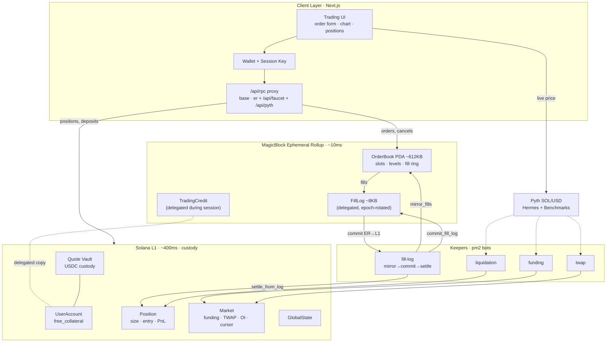
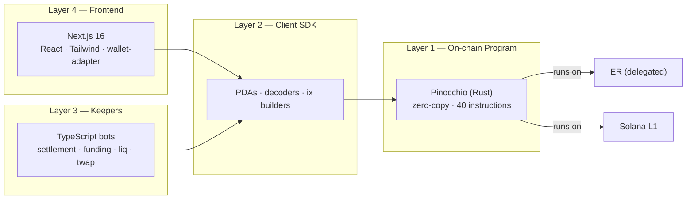
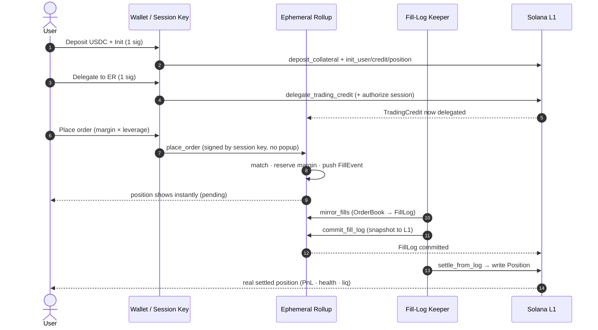
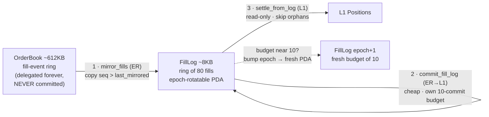
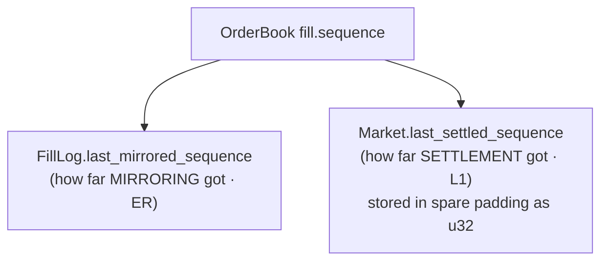
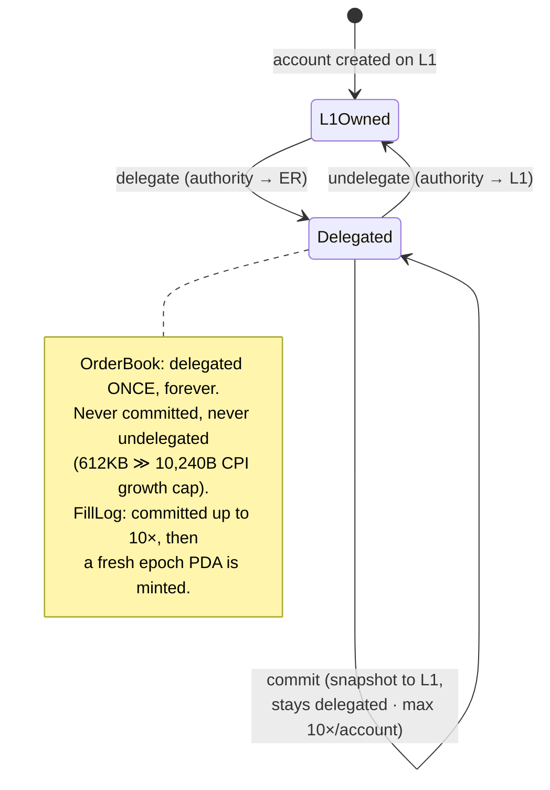
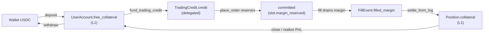
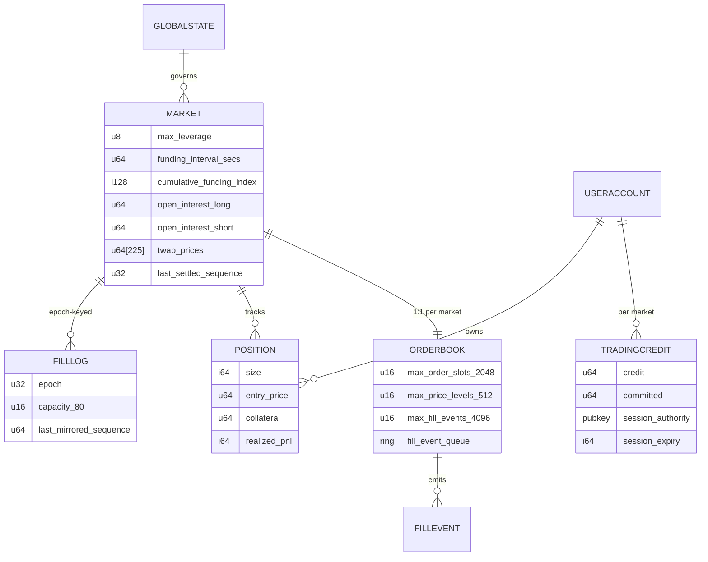
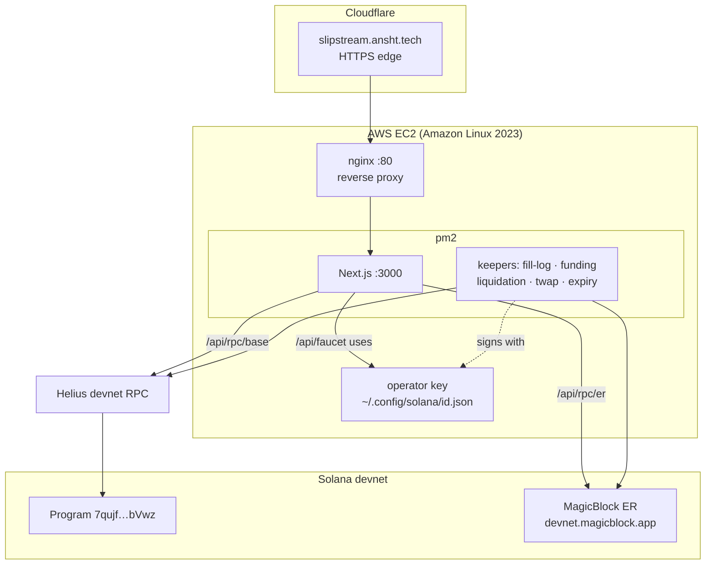

# 0 · Architecture Diagrams

> The whole system in pictures. Mermaid diagrams render live in the
> [web docs](https://slipstream.ansht.tech/docs); on GitHub they render too.
> Read [doc 1](./01-architecture-overview.md) for the prose walkthrough.

---

## 0.1 The layer cake — what lives where

The single most important idea: **hot, non-financial state runs fast on the
Ephemeral Rollup (ER); all value-bearing state stays safe on Solana L1.** Only
the OrderBook (and a scoped TradingCredit during a session) is ever delegated.

```
┌──────────────────────────────────────────────────────────────────────────┐
│  CLIENT LAYER                                                              │
│  Next.js frontend · wallet · session key · live Pyth chart                │
│      │ orders/cancels → /api/rpc/er          │ positions/$ → /api/rpc/base │
└──────┼──────────────────────────────────────┼──────────────────────────────┘
       │                                       │
┌──────▼───────────────────────────┐   ┌───────▼───────────────────────────────┐
│  EPHEMERAL ROLLUP (MagicBlock)    │   │  SOLANA L1 (base layer)                │
│  ~10 ms blocks · sponsored fees   │   │  ~400 ms blocks · real fees · secure   │
│                                   │   │                                        │
│  DELEGATED, mutated here:         │   │  NEVER delegated — only L1 moves these:│
│   • OrderBook (~612 KB)           │   │   • UserAccount  (free_collateral)     │
│       slots · price levels        │   │   • Position     (size/entry/PnL)      │
│       fill-event ring             │   │   • Market       (funding/TWAP/OI)     │
│   • TradingCredit (per session)   │   │   • Quote vault  (everyone's USDC)     │
│       margin allowance + session  │   │   • GlobalState  (pause/authority)     │
│                                   │   │   • FillLog (small) ← committed here   │
│  place_order · cancel_order       │   │  deposit · settle_from_log · funding   │
│  mirror_fills · commit_fill_log   │   │  liquidate · close · withdraw          │
└───────────────┬───────────────────┘   └───────────────▲────────────────────────┘
                │   commit small FillLog (ER → L1)        │
                └─────────────────────────────────────────┘
                         keepers crank the bridge
```

> **Safety boundary, one line:** delegation is capped, not unlimited — the
> OrderBook (non-financial) and a scoped, user-capped TradingCredit allowance
> are the only things ever delegated. A misbehaving ER can at worst scramble
> order *ordering* or misuse a session's capped credit — it can never touch
> the vault or a user's un-delegated balance.

---

## 0.2 System context (Mermaid)



---

## 0.3 The four software layers (Mermaid)



---

## 0.4 Order lifecycle — click to settled position (Mermaid sequence)



---

## 0.5 Settlement & the Fill-Log pipeline (Mermaid)

The 612 KB OrderBook **can never be committed** (size cap + 10-commit-per-account
cap). A tiny ~8 KB FillLog carries fills to L1 instead; epoch rotation gives
unbounded settlement.



Two independent progress cursors prevent double-processing:



---

## 0.6 Delegation state machine (Mermaid)



---

## 0.7 Margin flow — one dollar's journey (Mermaid)



`available = credit − committed`. Makers' stale `committed` is repaired by
`reconcile_credit` on their next action.

---

## 0.8 On-chain state map (Mermaid ER diagram)



---

## 0.9 Instruction map (0x00–0x27)

```mermaid
flowchart TB
  subgraph ADMIN["Admin / lifecycle (L1)"]
    A0["0x00 initialize_market"]
    A1["0x0C initialize_global"]
    A2["0x17 grow_orderbook"]
    A3["0x18 delegate_orderbook_prepare"]
    A4["0x09 delegate_orderbook"]
    A5["0x25 set_market_oracle"]
    A6["0x26 propose_authority · 0x27 accept_authority<br/>(two-step GlobalState.authority rotation)"]
  end
  subgraph USER["User lifecycle (L1)"]
    U0["0x01 initialize_user"]
    U1["0x02 deposit_collateral"]
    U2["0x19 initialize_position"]
    U3["0x0D init_trading_credit"]
    U4["0x0E fund_trading_credit"]
    U5["0x0F delegate_trading_credit"]
    U6["0x1B authorize_session"]
    U7["0x03 withdraw · 0x08 close"]
  end
  subgraph TRADE["Trading (ER)"]
    T0["0x10 place_order"]
    T1["0x11 cancel_order"]
  end
  subgraph TRIGGERS["SL/TP triggers"]
    G0["0x22 place_trigger (L1)"]
    G1["0x23 cancel_trigger (L1)"]
    G2["0x24 execute_trigger (L1, keeper-cranked)"]
  end
  subgraph SETTLE["Settlement / cranks"]
    S0["0x1F mirror_fills (ER)"]
    S1["0x20 commit_fill_log (ER)"]
    S2["0x21 settle_from_log (L1)"]
    S3["0x06 compute_funding (L1)"]
    S4["0x05 liquidate_position (L1)"]
    S5["0x0B crank_twap (L1)"]
  end

  ADMIN --> USER --> TRADE --> TRIGGERS --> SETTLE
```



---

## 0.10 Deployment topology (Mermaid)



---

## 0.11 Where to go next

- Prose walkthrough → [doc 1](./01-architecture-overview.md)
- How the 612 KB PDA works → [doc 2](./02-orderbook-and-pda-storage.md)
- ER / delegation / commit cap → [doc 3](./03-ephemeral-rollups-and-delegation.md)
- The fill-log pipeline in depth → [doc 4](./04-settlement-and-the-fill-log.md)
